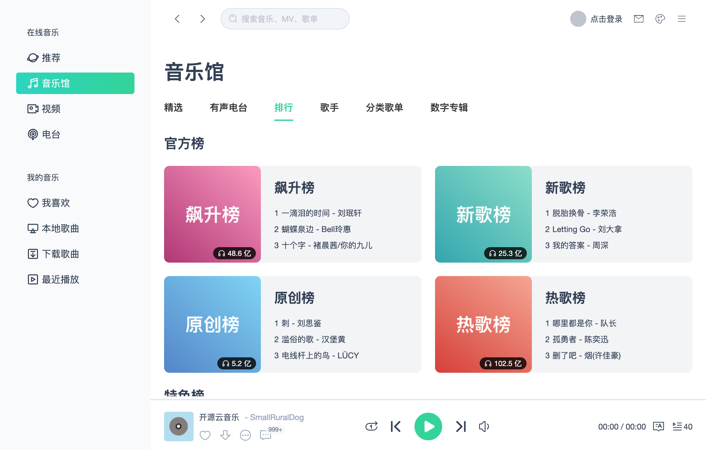
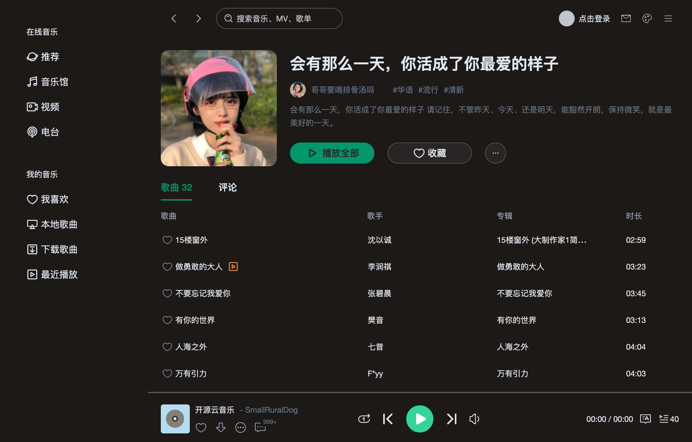

# Mac-Music

A music player developed based on VUE3+TS, with a music mac client interface.

Online experience: [https://smallruraldog.github.io/vue3-music](https://smallruraldog.github.io/vue3-music)

Set the browser size to 1050*670 for a better experience! The interface is adaptive and is implemented using [tailwindcss.com](https://www.tailwindcss.com)

For security reasons, the online demonstration does not provide API interface services. You need to prepare your own API service address, and it is HTTPS. Services without HTTPS can be run locally. When you open it for the first time, you will be asked to set the API address.


## Local installation

```
git clone https://github.com/SmallRuralDog/vue3-music.git
cd vue3-music
yarn
yarn run dev
```

## NetEase Cloud Music API

The API service needs to be running for normal experience

[Development documentation](https://binaryify.github.io/NeteaseCloudMusicApi)


## UI







